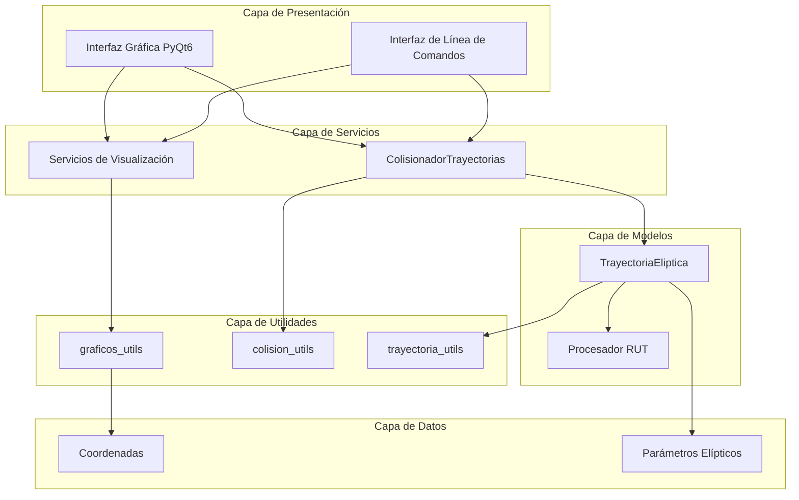
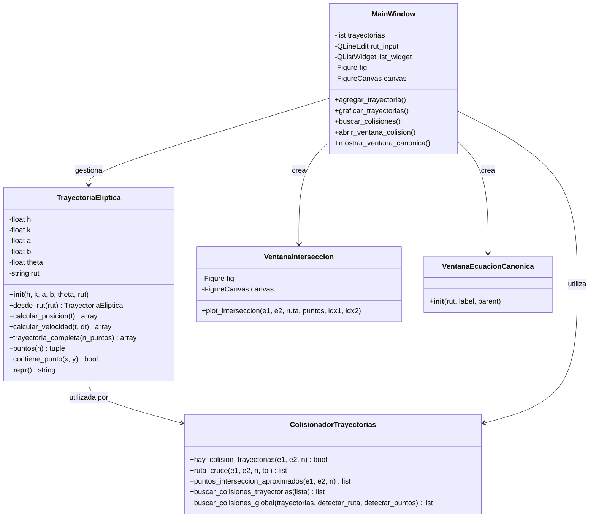
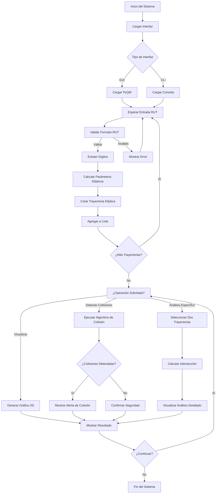
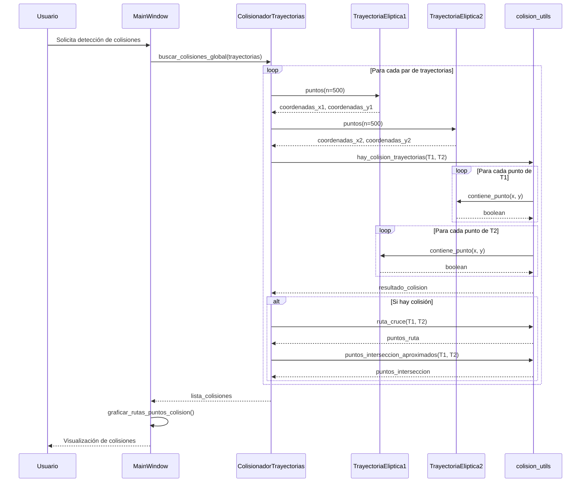
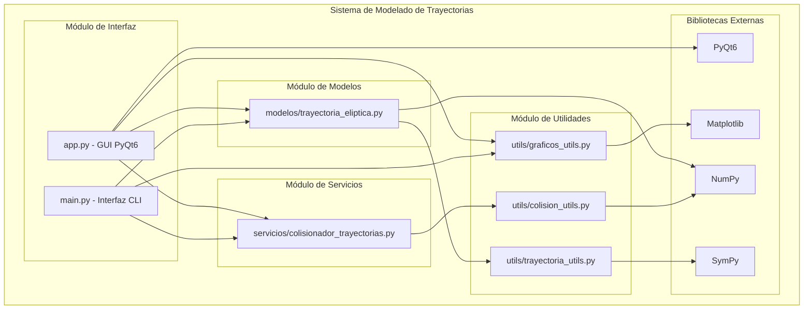
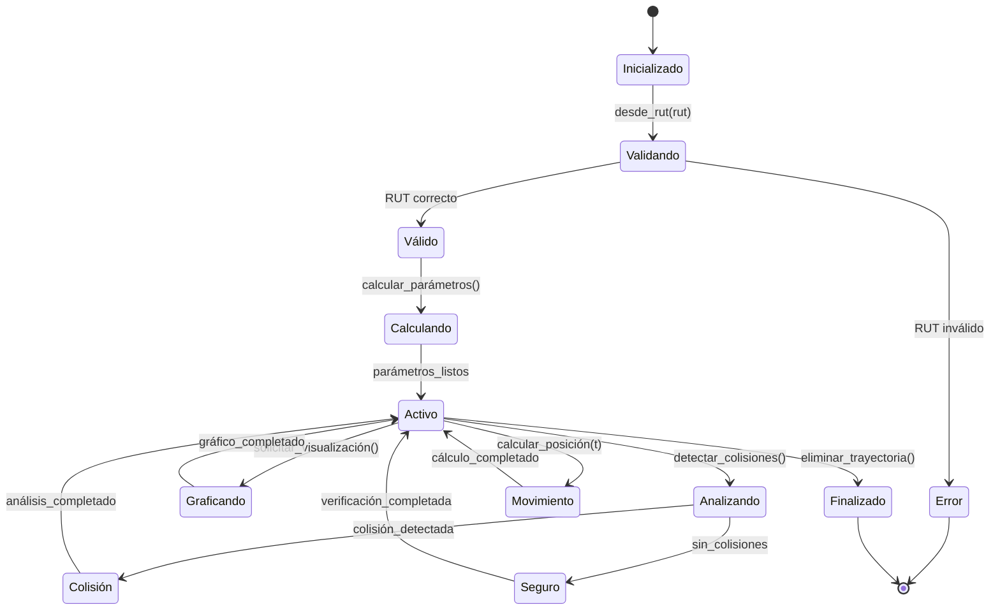
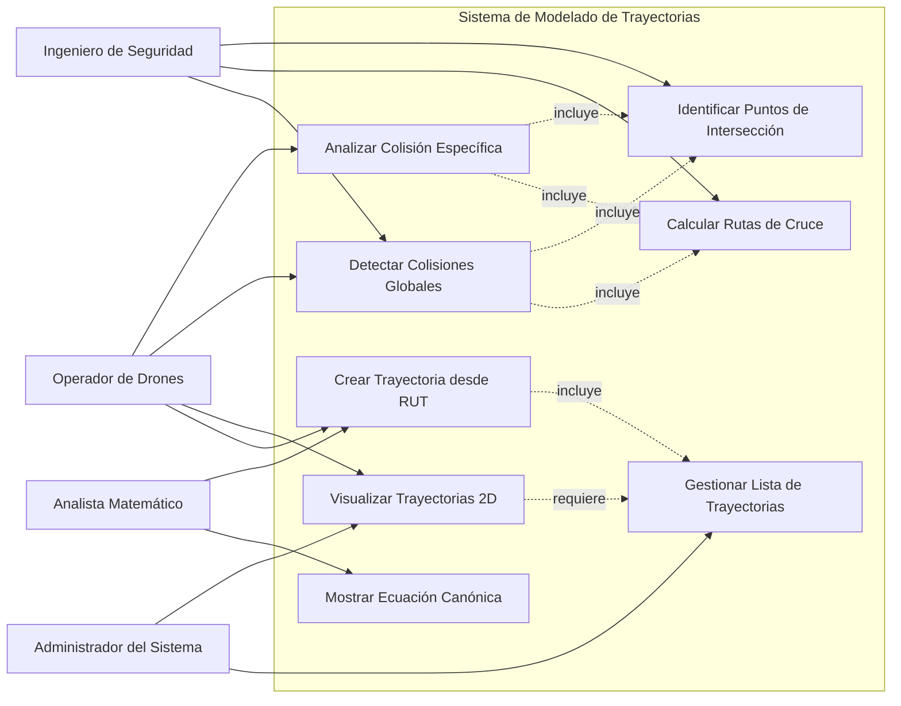

# Diagramas del Proyecto - Modelado de Trayectorias Elípticas

## Tabla de Contenidos
1. [Diagrama de Arquitectura General](#diagrama-de-arquitectura-general)
2. [Diagrama de Clases](#diagrama-de-clases)
3. [Diagrama de Flujo del Sistema](#diagrama-de-flujo-del-sistema)
4. [Diagrama de Secuencia - Detección de Colisiones](#diagrama-de-secuencia---detección-de-colisiones)
5. [Diagrama de Componentes](#diagrama-de-componentes)
6. [Diagrama de Estados de Trayectoria](#diagrama-de-estados-de-trayectoria)
7. [Diagrama de Casos de Uso](#diagrama-de-casos-de-uso)

## Diagrama de Arquitectura General

## Diagrama de Clases

## Diagrama de Flujo del Sistema

## Diagrama de Secuencia - Detección de Colisiones

## Diagrama de Componentes

## Diagrama de Estados de Trayectoria

## Diagrama de Casos de Uso

---

## Notas sobre los Diagramas

### Arquitectura del Sistema
- **Capa de Presentación**: Maneja las interfaces de usuario (GUI y CLI)
- **Capa de Servicios**: Contiene la lógica de negocio para detección de colisiones
- **Capa de Modelos**: Define las estructuras de datos para trayectorias elípticas
- **Capa de Utilidades**: Proporciona funciones auxiliares para cálculos y visualización

### Flujo de Datos
1. El usuario ingresa un RUT
2. El sistema extrae los dígitos y calcula parámetros elípticos
3. Se crea una instancia de TrayectoriaEliptica
4. El sistema puede realizar análisis de colisiones o visualizaciones
5. Los resultados se presentan al usuario

### Algoritmos de Colisión
- **Detección básica**: Verifica si puntos de una elipse están dentro de otra
- **Ruta de cruce**: Identifica todos los puntos donde las trayectorias se solapan
- **Puntos de intersección**: Encuentra ubicaciones específicas donde las trayectorias se cruzan

### Consideraciones de Seguridad
- Validación rigurosa de entrada de datos
- Manejo de errores en cálculos matemáticos
- Alertas visuales para situaciones de riesgo de colisión